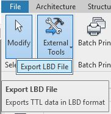

# Revit LBD Exporter
Export data from Autodesk Revit to LBD graphs (BOT, BEO, PROPS, MEP, Geometry). The tool exports a TTL file that can be used elsewhere.

## How to run the code
The code in this TUe repository currently only runs in Debug mode. In other words, the code needs to be opened in a code editor such as Microsoft Visual Studio (not VS Code), with Revit running in the background with the plug-in.

1. Add the plugin to your Revit installation by copying file `LBDExporter.addin` to `C:\ProgramData\Autodesk\Revit\Addins\2021` and modifying the following line in the file `C:\PathToFile\revit-bot-exporter\bin\Debug\TUe.ISBE.LBDExporter.dll`.
2. Start MS Visual Studio and make sure that the project builds a DLL in the mentioned location (`C:\PathToFile\revit-bot-exporter\bin\Debug\TUe.ISBE.LBDExporter.dll`).
3. Start Revit, Debug code, Work with the plugin.

Debugging and running the code with Revit can be done in several ways (Google).

## How to work with the plugin
When running Revit, the plugin exporter is available in the Addin tab.

Export LBD file, and find the saved file on your machine.

## How does the code function - how to add functionality
The code mainly has one `Main.cs` class with main exporter functionality, as displayed below. This class contains one exporter function `Export` that points to subroutines which export individual elements types (walls, doors, etc.). The code iterates through elements of a certain type and exports them. This code can easily be expanded or modified to alternative exports.

## Acknowledgements
The code is initially developed by Jonas Eik Bacher-Jacobsen, at NIRAS.
It is made available by Mads Holten Rasmussen (NIRAS) at https://github.com/MadsHolten/revit-bot-exporter.
Edits were made afterwards to also enable the export of specific other parts in the Revit model.
